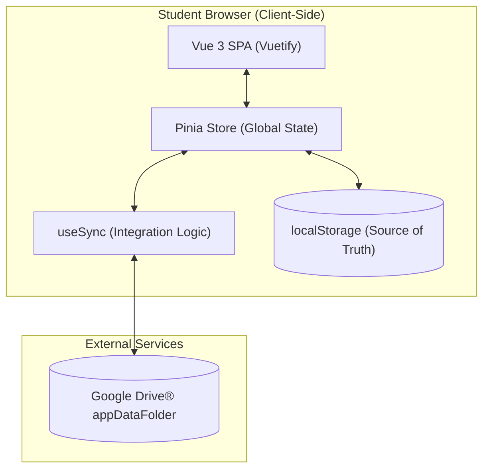

# Equilibra Que Dá!

**Equilibra Que Dá!** is an initiative by **Prof. Me. Igor Gacheiro da Silva** (IFRN - Campus Nova Cruz), developed by **Giovanni Vasconcelos de Medeiros**. The application allows students to track their performance while solving ENEM questions by logging study sessions per subject, visualizing detailed analytics, and identifying primary error causes, all without account creation or dependency on a project-owned external server.

---

## ✨ Features

- 📝 **Session logging** by subject (Math, Languages, Natural Sciences, Human Sciences, and their sub-disciplines).
- 🗒️ **Optional session notes** to capture context, strategy, and key observations for each study run.
- 📚 **Paginated history** with subject filtering, deletion, and **quick duplication** of records.
- ⚡ **Fast editing** through integrated modals, without page-to-page navigation.
- 📊 **Analytical dashboard** with KPIs and bar, doughnut, line, and radar charts, including time-oriented study metrics.
- 🎯 **Configurable daily and weekly goals** per user.
- 💾 **Local Persistence** via `localStorage` - data remains on the student's device, with no account required.
- ☁️ **Cloud sync via Google Drive®** - students use their Google® account to save and restore progress across devices, with no additional account setup. Data is stored in a private, isolated folder (`appDataFolder`) inside each student's own Google Drive®. No data traverses project-owned servers (**LGPD** - Brazil's General Data Protection Law).
  - Automatic synchronization with **5s debounce** to optimize bandwidth.
  - Manual synchronization available in the top bar and Settings page.
  - Smart merge: sessions are merged by ID; `localStorage` is always the primary source of truth.
    - Conflict detection with a guided dialog so users can resolve cloud/local divergence safely.
    - Explicit confirmation before disconnecting a Google Drive® account.
- 🌐 PWA (Progressive Web App) - installable on mobile for native-like use.
- 🌐 **100% client-side** - no requests to external backend services.
- 🎨 **Custom dark theme** (`enemDark`) integrated with Vuetify 3.
- ✅ **Form validation** with Zod - business rules enforced at compile time and runtime.
- 💾 **Full Portability** - backup and restore through `.json` files with integrity validation.
- 🚀 Interactive onboarding - guided tutorial for new users.

---

## 📖 Requirements

| Tool | Minimum version |
|---|---|
| Node.js | `^24.x` (recommended via `.tool-versions`) |
| npm | `^10.x` |
| jq | `^1.6` (required for `release.sh`) |
| driver.js | `^1.4.0` (onboarding tour) |
| remotestoragejs | removed in v1.3.0 - replaced by native Google® Identity Services |

> The [`.tool-versions`](.tool-versions) file lets you manage Node.js versions with [asdf](https://asdf-vm.com/) or [mise](https://mise.jdx.dev/).

---

## 🏗️ Architecture

### Nuxt 3 + Local Persistence (Pure SPA)

The application is built on **Nuxt 3** configured as a **Single Page Application (SPA)**. The key engineering decision is to avoid a project-owned backend, delegating persistence and synchronization entirely to the client side.



**🧠 Engineering Decisions: Why Pure SPA (`ssr: false`)?**

Unlike content portals, **Equilibra Que Dá!** was purpose-built as a pure **Single Page Application (SPA)** for strategic architectural reasons:

1. **Data Sovereignty and Privacy:** Because the app processes sensitive study data and integrates with Google Drive® entirely on the client side, disabling SSR ensures no data is processed or relayed through third-party application servers (other than Google's own infrastructure).
2. **Offline-First Performance:** Once loaded, the app runs entirely in the browser. This removes server round-trip latency on each route transition, which is essential for a strong PWA experience.
3. **Infrastructure Efficiency:** The build outputs only static files (HTML/JS/CSS), allowing Vercel to serve the app through its **Edge Network (CDN)** at zero infrastructure cost and very high availability, with no always-on Node.js instances.

---

### Application Layers

| Layer | Directory | Responsibility |
|---|---|---|
| **Types and Schemas** | `types/index.ts` | Enums, Zod schemas, TypeScript types |
| **Global State** | `stores/study.ts` | Pinia store with `localStorage` persistence |
| **Cloud Sync** | `composables/useSync.ts` | Google Drive® integration: upload, download, offline-first merge |
| **Components** | `components/` | Decoupled, reusable UI elements |
| **Business Logic** | `composables/useStatistics.ts` | Statistical calculations and chart datasets |
| **Interface (Pages)** | `pages/`, `layouts/` | Application orchestration screens |
| **Plugins** | `plugins/` | Vuetify, Pinia, Chart.js, and SyncStudy initialization |

### Types and Validation (Zod)

All data contracts are defined in [`types/index.ts`](types/index.ts) with [Zod](https://zod.dev/). A notable implementation detail is the **Zero-Error Logic**, implemented through `.superRefine()` in `SessionSchema`:

```ts
export const SessionSchema = z.object({
    id:                  z.string().uuid(),
    date:                z.string().min(1),
    subject:             Materia,
    totalQuestions:      z.number().int().min(1),
    wrongQuestions:      z.number().int().min(0),
    correctQuestions:    z.number().int().min(0),
    primaryErrorReason:  MotivoErro.nullable(), // Supports Zero-Error Logic
}).superRefine((data, ctx) => {
    // If errors exist, a reason must be provided
    if (data.wrongQuestions > 0 && data.primaryErrorReason === null) {
        ctx.addIssue({ code: z.ZodIssueCode.custom, message: 'If errors are present, a reason must be selected.', path: ['primaryErrorReason'] })
    }
    // If no errors, the reason must be null
    if (data.wrongQuestions === 0 && data.primaryErrorReason !== null) {
        ctx.addIssue({ code: z.ZodIssueCode.custom, message: 'Sessions with no errors should not have a reason.', path: ['primaryErrorReason'] })
    }
})
```

---

### Cloud Synchronization - Offline-First Architecture

Synchronization is an **optional layer** on top of `localStorage`. The flow respects the **offline-first principle**:

```
localStorage  ←──(source of truth)──→  Google Drive® (appDataFolder)
      │                                    │
      │  uploadData(data)  ──────────────► │
      │                                    │
      │◄────────────── downloadAndMerge()  │
      │  (merge by ID: local wins on ID collision)  │
```

**Merge flow (`_mergeSessions`):**
1. Build a `Map<id, Session>` with all remote sessions.
2. Overwrite entries with local sessions (local wins on ID collision).
3. Include remote-only sessions (data recovery from other devices).

**5s debounce:** The `syncStudy.client.ts` plugin subscribes to Pinia's `$subscribe` and schedules uploads with a 5-second delay. Rapid sequential edits are consolidated into a single upload.

**Graceful degradation:** If Google Drive® or authentication fails, the store continues operating from `localStorage`. Errors are exposed only on the Settings page.

**Safety timeout (15s):** The `connect()` function triggers a 15-second `setTimeout` after `requestAccessToken()`. If the OAuth popup does not resolve in this window (blocked popup, network issue), the `isConnecting` state is reset and an actionable error message is displayed to the user.

#### Google Drive® - Native API

Sync is implemented directly against the **Google Drive® REST API v3** using the official **Google Identity Services® (GIS)** SDK, with no intermediary abstraction libraries.

| Aspect | Detail |
|---|---|
| **Authentication** | Google Identity Services® (`https://accounts.google.com/gsi/client`) - OAuth 2.0 via popup, without page redirection |
| **Token** | `access_token` stored in `sessionStorage` (expires when tab closes); expiry epoch tracked to avoid near-expired token usage |
| **Scope** | `https://www.googleapis.com/auth/drive.appdata` - exclusive access to the hidden app folder, without touching personal files |
| **Upload** | Multipart POST for creation; media PATCH for update; automatic re-creation if file is externally deleted (404 → POST) |
| **Download** | GET with `alt=media` for direct content retrieval, after `list` resolves file ID |
| **Token Expiry** | Drive API 401 responses trigger `_handleAuthExpiry()`, which clears the token and prompts re-authentication |
### Portabilidade e Backup

Como o estado reside exclusivamente no navegador do aluno, a aplicação implementa um sistema de **Backup e Restauração** via arquivo JSON, garantindo a portabilidade dos dados entre dispositivos.

- **Exportação (`exportData`):** A store Pinia gera um arquivo `.json` contendo as sessões e metas, incluindo um timestamp `exportedAt`.
- **Importação (`importData`):** Valida a integridade do arquivo utilizando `LocalStorageSchema.safeParse` antes de persistir no `localStorage`.
- **Segurança e Integridade:** O uso do Zod garante que dados importados respeitem todas as regras de negócio (ex: total de acertos deve ser coerente com o total de questões).

### Analytics (Estatísticas)

O composable [`composables/useStatistics.ts`](composables/useStatistics.ts) processa os dados para visualização. Para manter a relevância pedagógica, os gráficos de **"Motivos de Erro"** filtram automaticamente entradas onde `primaryErrorReason` é nulo, focando apenas nos pontos de melhoria real.

### Onboarding Interativo

A primeira experiência do usuário é guiada pelo composable [`composables/useOnboarding.ts`](composables/useOnboarding.ts), que utiliza a biblioteca **driver.js**.

- **Persistência:** O status do tour é controlado pela chave `equilibra-onboarding-completo` no `localStorage`.
- **Design:** O tour possui estilização customizada (`.equilibra-popover`) para o tema **enemDark**, com background em tom *surface* (`#434343`) e botões na cor *primary* baseado nas cores do IFRN.
- **Tour Manual:** O usuário pode reiniciar o tutorial a qualquer momento através do modal de Configurações.

---

## 🔖 Versionamento e Release

### Automação com `release.sh`

Para manter a consistência do projeto, utilizamos o script [`scripts/release.sh`](scripts/release.sh), que automatiza o ciclo de vida de novas versões:

1. **Bump de Versão:** Atualiza o versionamento no `package.json` seguindo o padrão SemVer.
2. **Registro:** Atualiza o `CHANGELOG.md` com as mudanças recentes.
3. **Git Tag:** Cria uma tag anotada localmente.
4. **Deploy:** Ao realizar o push da tag (`git push --tags`), o **GitHub Actions** dispara automaticamente o build e deploy para produção no branch `main`.

---

## 🗂️ Estrutura do Projeto

```
equilibra-que-da-pwa/
├── app.vue                     # Entrada da aplicação Vue e Estilos do Driver.js
├── nuxt.config.ts              # Configuração do Nuxt 3 / Nitro (preset: static)
├── vercel.json                 # Headers de cache agressivo para o Edge Network
├── package.json
├── tsconfig.json
├── .tool-versions              # Versão do Node.js (asdf/mise)
│
├── components/                 # Componentes Vue reutilizáveis
│   └── SessionForm.vue         # Lógica centralizada de registro e validação
│
├── .github/
│   └── workflows/
│       └── deploy.yml          # CI/CD: deploy apenas em tags de release
│
├── types/
│   └── index.ts                # Schemas Zod com Lógica de Erro Zero
│
├── stores/
│   └── study.ts                # Pinia store com exportData/importData
│
├── composables/
│   ├── useStatistics.ts        # Lógica de cálculo (filtros de relevância)
│   └── useOnboarding.ts        # Gerenciamento do Tour de Boas-vindas
│
├── pages/
│   ├── index.vue               # Dashboard de desempenho
│   ├── registrar.vue           # Registro/edição de sessão
│   ├── historico.vue           # Histórico de registros
│   └── ajuda-backup.vue        # Guia detalhado de backup
│
├── layouts/
│   └── default.vue             # Layout com Toolbar e Navigation Drawer
│
├── plugins/
│   ├── vuetify.ts              # Vuetify 3 com @mdi/js (tree-shaking de ícones)
│   ├── pinia.ts                # Inicialização do Pinia com persistedstate
│   └── chartjs.client.ts       # Registro dos componentes do Chart.js (client-only)
│
├── public/
│   └── assets/images/          # Logos e imagens (preferencialmente WebP)
│
└── scripts/
    └── release.sh              # Automação de releases SemVer
```

---

## Middlewares

### Client-side (Vue Router)

O Nuxt registra automaticamente arquivos em `middleware/` como guardas de rota do lado do cliente. Eles são executados antes da navegação e têm acesso ao contexto de rota (`to`, `from`). Exemplo de um guard que poderia proteger rotas:

```ts
// Initialization (composables/useSync.ts)
const tokenClient = google.accounts.oauth2.initTokenClient({
    client_id: CLIENT_ID,
    scope: 'https://www.googleapis.com/auth/drive.appdata',
    callback: (tokenResponse) => { /* Store token and update sync state */ },
    error_callback: (err) => { /* Popup closed, blocked, etc. */ },
})
```

#### Data Sovereignty (LGPD)

LGPD (Lei Geral de Proteção de Dados - Brazil's General Data Protection Law) is conceptually comparable to GDPR principles around lawful processing, minimization, and user control.

- The only infrastructure processing student data is the service explicitly chosen by the user.
- The project has no access to OAuth tokens, session data, or usage metadata.
- Cloud connectivity is 100% optional; removing this feature does not affect any student data.
- OAuth tokens remain in the student's device `sessionStorage` - not in cookies and not in any external project database.

#### Google Drive® Privacy (`drive.appdata`)

When students connect a Google® account, native Google Drive® integration uses only the **`drive.appdata`** scope, which grants access solely to a hidden, isolated folder created for this app (`appDataFolder`). This ensures:

- The application **cannot read, modify, or delete** any personal files in the user's Google Drive®.
- The app folder remains invisible in the student's standard Google Drive® file list.
- Students can revoke access anytime via [Google Account Settings → Third-party apps](https://myaccount.google.com/permissions).
- The project does not store, relay, or access Google® authentication tokens.

**Integration with Google Drive:** The OAuth Client ID resides in `composables/useSync.ts` (constant `CLIENT_ID`). Generate it in [Google Cloud Console®](https://console.cloud.google.com/) with the scope restricted to `https://www.googleapis.com/auth/drive.appdata` and authorized origins configured for your production domain.

---

### Portability and Manual Backup

Because state lives exclusively in the student's browser, the app provides **Backup and Restore** through JSON files, ensuring cross-device portability.

- **Export (`exportData`):** The Pinia store generates a `.json` file containing sessions and goals, including an `exportedAt` timestamp.
- **Import (`importData`):** Validates file integrity with `LocalStorageSchema.safeParse` before persisting into `localStorage`.
- **Data Import and Validation:** Validates file structure against `LocalStorageSchema.safeParse` before persisting into `localStorage`. Schema enforcement guarantees all imported data complies with business rules (e.g., correct answer count aligns with total questions).

### Analytics (Statistics)

The composable [`composables/useStatistics.ts`](composables/useStatistics.ts) processes data for visualization. To keep pedagogical relevance, **"Error Reasons"** charts automatically filter entries where `primaryErrorReason` is null, focusing only on actionable improvement points.

### Interactive Onboarding

First-time user experience is guided by [`composables/useOnboarding.ts`](composables/useOnboarding.ts), powered by **driver.js**.

- **Persistence:** Tour completion status is persisted via the `equilibra-onboarding-completo` key in `localStorage`.
- **Design:** The tour uses custom styling (`.equilibra-popover`) for the **enemDark** theme, with *surface* background (`#434343`) and IFRN *primary* color buttons.
- **Manual Tour:** Users can restart the tutorial anytime from the Settings modal.

---

## 🔖 Versioning and Release

### Automation with `release.sh`

To ensure consistency across releases, we leverage the [`scripts/release.sh`](scripts/release.sh) script to automate the entire release lifecycle:

1. **Version Bump:** Updates `package.json` following SemVer standards.
2. **Changelog Generation:** Updates `CHANGELOG.md` with recent commits.
3. **Git Tagging:** Creates an annotated local tag.
4. **Automated Deployment:** When the tag is pushed (`git push --tags`), GitHub Actions automatically triggers build and production deployment on the `main` branch.

---

## Middlewares (Client-side)

Nuxt automatically registers files in the `middleware/` directory as client-side route guards. They execute before each navigation and have access to route context (`to`, `from`). Use them to validate application state or redirect users before rendering pages.

---

## 📦 Installation

### Local Environment

**1. Clone the repository:**

```bash
git clone https://github.com/vasconcelos-giovanni/equilibra-que-da-pwa.git
cd equilibra-que-da-pwa
```

**2. Install dependencies:**

```bash
npm install
```

> The `postinstall` script runs `nuxt prepare` automatically, generating TypeScript types in `.nuxt/`.

**3. Start the development server:**

```bash
npm run dev
```

The application will be available at `http://localhost:3000`.

### Production Build

**Standard build (Node.js as Nitro server):**

```bash
npm run build
npm run preview   # test the local build
```

#### Static Generation (Recommended)

```bash
npm run generate
```

The `generate` command outputs a `.output/public/` directory with static HTML/CSS/JS files that can be served by any CDN or static file server.

### Deployment on Serverless Platforms

#### Vercel

Vercel auto-detects Nuxt 3 projects. Just connect the repository. The site is served statically via the `vercel-static` preset.

---

## Pages

| Route | File | Description |
|---|---|---|
| `/` | `pages/index.vue` | Dashboard with KPIs, charts, and goals |
| `/register-sessions` | `pages/register-sessions.vue` | Container for fast session entry |
| `/history` | `pages/history.vue` | Listing with modal-based editing/duplication |
| `/settings` | `pages/settings.vue` | Cloud sync, goals, backup, and tutorial |
| `/backup-help` | `pages/backup-help.vue` | Data export/import guide |
| `/privacy` | `pages/privacy.vue` | Privacy policy and data sovereignty overview |
| `/terms-of-usage` | `pages/terms-of-usage.vue` | Application terms of usage |

---

## ⚡ Performance Optimizations

### Build Strategy: Static Site Generation (SSG)

Nitro is configured with `preset: 'static'`. The `npm run generate` command produces 100% static assets in `.output/public/`, which Vercel serves directly via **Edge Network (CDN)**, without invoking Serverless Functions. With 150 users/month, the app remains comfortably within the free Hobby tier.

```
User → Vercel Edge (CDN) → .output/public/
  ↑
Cache-Control: max-age=31536000, immutable
(JS/CSS with content hash never expires)
```

### Aggressive Cache (`vercel.json`)

The [`vercel.json`](vercel.json) file sets HTTP headers by route pattern:

| Pattern | Cache-Control | Strategy |
|---|---|---|
| `/_nuxt/**`, `/**/*.js`, `/**/*.css` | `immutable, 1 year` | Content hash changes every deploy |
| `/assets/**`, `/**/*.webp` | `immutable, 1 year` | Hashed assets |
| `/**/*.html` | `must-revalidate` | HTML always revalidated to fetch latest bundle |

### Icon Tree-Shaking (`@mdi/js`)

The `@mdi/font` package loaded a ~300 KB CSS file with every MDI icon. It was replaced by `@mdi/js`, which exports each icon as an individual SVG constant.

**Before:** `@mdi/font` → ~300 KB (CSS + woff2 with all icons)  
**After:** `@mdi/js` → only imported icons enter the bundle

How to use icons in Vue components:

```vue
<script setup lang="ts">
import { mdiCheckCircleOutline, mdiCloseCircleOutline } from '@mdi/js'
</script>

<template>
  <!-- Inline icon via SVG path -->
  <v-icon :icon="mdiCheckCircleOutline" color="success" />
  <v-icon :icon="mdiCloseCircleOutline" color="error" />
</template>
```

> All available icons are listed on [@mdi/js on npm](https://www.npmjs.com/package/@mdi/js). Naming follows camelCase: `mdi-check-circle-outline` → `mdiCheckCircleOutline`.

### `localStorage` Validation (Anti-CLS)

`pinia-plugin-persistedstate` hydrates the store from `localStorage` during first load. Corrupted or outdated data can trigger runtime errors and unnecessary re-renders (CLS - Cumulative Layout Shift).

The custom serializer in [`stores/study.ts`](stores/study.ts) wraps deserialization with `LocalStorageSchema.safeParse()`. If validation fails, a safe default state is silently applied:

```ts
serializer: {
    serialize: JSON.stringify,
    deserialize: (raw) => {
        try {
            const result = LocalStorageSchema.safeParse(JSON.parse(raw))
            if (result.success) return result.data
            return LocalStorageSchema.parse({})  // Safe default state
        } catch {
            return LocalStorageSchema.parse({})
        }
    },
},
```

`LocalStorageSchema` is defined in [`types/index.ts`](types/index.ts) and validates the full persisted state structure:

```ts
export const LocalStorageSchema = z.object({
    sessions: z.array(SessionSchema).default([]),
    goal: GoalSchema.default({ dailyTarget: 30, weeklyTarget: 150 }),
})
```

### Asset Compression

Nitro is configured with `compressPublicAssets: { brotli: true, gzip: true }`. All static assets are pre-compressed as Brotli and Gzip during `npm run generate`.

> **Recommendation:** Convert images in `public/assets/images/` to **WebP**. Suggested tools: [Squoosh](https://squoosh.app/) or `npx @squoosh/cli --webp auto public/assets/images/*.png`.

---

## 🔖 Versioning and Release

### Semantic Commits

The project adheres to the [Conventional Commits](https://www.conventionalcommits.org/) specification. Commit messages should follow:

```
<type>[optional scope]: <short description>

[optional body]

[optional footer(s)]
```

#### Allowed Types

| Type | When to use | SemVer impact |
|---|---|---|
| `feat` | New user-facing functionality | `minor` |
| `fix` | Bug fix | `patch` |
| `perf` | Performance improvement | `patch` |
| `refactor` | Refactor with no behavioral change | - |
| `style` | Formatting, whitespace | - |
| `test` | Add or fix tests | - |
| `docs` | Documentation change | - |
| `chore` | Maintenance tasks (build, deps, CI) | - |
| `ci` | CI/CD pipeline changes | - |
| `revert` | Revert a previous commit | depends |

#### Breaking Changes

Any type can indicate a **breaking change** with `!` before the colon or with `BREAKING CHANGE:` in the footer:

```
feat!: rename localStorage key to avoid conflicts

BREAKING CHANGE: Previous key 'enem-tracker-data' replaced with
'enem-tracker-v2'. Existing data will be lost during migration.
```

#### Examples

```bash
# New functionality
git commit -m "feat(history): add date range filter"

# Bug fix
git commit -m "fix(stats): correct accuracy rate calculation when total is zero"

# Dependency update
git commit -m "chore(deps): upgrade nuxt to 3.15.0"

# Documentation
git commit -m "docs: add Vercel deployment section to README"
```

### CI/CD with GitHub Actions

The workflow [`.github/workflows/deploy.yml`](.github/workflows/deploy.yml) ensures Vercel only receives deployments when a release tag is created, so **routine commits do not consume Build Minutes**.

```
git push origin feat/nova-funcionalidade  → ✗  No deployment
git push origin main                      → ✗  No deployment
git push origin v1.2.0                    → ✅  Production deployment
```

#### Secrets Configuration

Configure the following secrets in your repository settings (**Settings → Secrets and variables → Actions**):

| Secret | How to get it |
|---|---|
| `VERCEL_TOKEN` | [vercel.com/account/tokens](https://vercel.com/account/tokens) |
| `VERCEL_ORG_ID` | Run `npx vercel link` and read `.vercel/project.json` |
| `VERCEL_PROJECT_ID` | Same as above |

#### Full Release Flow

```bash
# 1. Finalize features on the main branch
git checkout main

# 2. Run release script (bumps version, generates CHANGELOG, creates tag)
./scripts/release.sh minor

# 3. Push the tag - this triggers deployment automatically
git push origin main --follow-tags
# or separately:
git push origin v1.2.0
```

### Release Script

The [`scripts/release.sh`](scripts/release.sh) file automates the full release process:

1. Validates Git repository status (branch, working tree).
2. Reads current version from `package.json`.
3. Calculates next version based on bump type (`patch`, `minor`, `major`).
4. Generates or updates `CHANGELOG.md` with commits since the last tag.
5. Updates `package.json` version.
6. Creates release commit and annotated Git tag.
7. (Optional) Pushes the tag to the remote repository.

#### Usage

```bash
# Make script executable (first time only)
chmod +x scripts/release.sh

# Patch bump (fixes) - ex: 1.0.0 → 1.0.1
./scripts/release.sh patch

# Minor bump (new features) - ex: 1.0.0 → 1.1.0
./scripts/release.sh minor

# Major bump (breaking changes) - ex: 1.0.0 → 2.0.0
./scripts/release.sh major

# Pre-release - ex: 1.0.0 → 1.1.0-beta.1
./scripts/release.sh minor --pre beta

# Simulate release without changing anything (dry-run)
./scripts/release.sh minor --dry-run

# Interactive mode (asks for bump type)
./scripts/release.sh
```

---

## 📂 Project Structure

```text
.
├── .github/workflows/      # CI/CD pipelines (GitHub Actions)
├── components/             # Reusable Vue components
│   ├── PrivacyWarning.vue  # Data sovereignty and privacy dialog
│   ├── SessionForm.vue     # Core study form logic (refactored)
│   └── SyncButton.vue      # Manual cloud sync component
├── composables/            # Shared business logic (auto-imported)
│   ├── useOnboarding.ts    # Interactive tour logic (driver.js)
│   ├── useStatistics.ts    # Data processing for Chart.js
│   └── useSync.ts          # Google Drive REST API v3 integration
├── layouts/                # Base UI structures (Nuxt layouts)
├── pages/                  # File-based routing (localized URLs)
│   ├── backup-help.vue     # Data persistence guide
│   ├── history.vue         # Session history and management
│   ├── index.vue           # Dashboard / home page
│   ├── privacy.vue         # Privacy policy and data sovereignty
│   ├── register-sessions.vue # Main study-session entry point
│   ├── settings.vue        # Central settings panel
│   └── terms-of-usage.vue  # Application terms of usage
├── plugins/                # Nuxt plugins (client-side and third-party)
│   ├── chartjs.client.ts   # Data visualization setup
│   ├── syncStudy.client.ts # Global sync/persistence watcher
│   └── vuetify.ts          # Material Design 3 framework
├── public/                 # Static assets (favicons, manifest, logos)
├── scripts/                # Utility scripts (SemVer release automation)
├── stores/                 # State management (Pinia)
│   └── study.ts            # Reactive study data and local persistence
├── types/                  # Global TypeScript interfaces and schemas
├── nuxt.config.ts          # Nuxt framework configuration
├── package.json            # Project dependencies and scripts
└── tsconfig.json           # TypeScript configuration
## 🗂️ Estrutura do Projeto

```
equilibra-que-da-pwa/
├── app.vue                     # Entrada da aplicação Vue
├── nuxt.config.ts              # Configuração do Nuxt 3 / Nitro (preset: static)
├── vercel.json                 # Headers de cache agressivo para o Edge Network
├── package.json
├── tsconfig.json
├── .tool-versions              # Versão do Node.js (asdf/mise)
│
├── .github/
│   └── workflows/
│       └── deploy.yml          # CI/CD: deploy apenas em tags de release
│
├── types/
│   └── index.ts                # Enums, schemas Zod, LocalStorageSchema
│
├── stores/
│   └── study.ts                # Pinia store com serializer Zod anti-CLS
│
├── composables/
│   └── useStatistics.ts        # Lógica de cálculo e datasets para Chart.js
│
├── pages/
│   ├── index.vue               # Dashboard de desempenho
│   ├── registrar.vue           # Registro/edição de sessão de estudo
│   ├── historico.vue           # Histórico de registros
│   └── ajuda-backup.vue        # Guia de backup e restauração
│
├── layouts/
│   └── default.vue             # Layout principal (AppBar, Navigation Drawer, Footer)
│
├── plugins/
│   ├── vuetify.ts              # Vuetify 3 com @mdi/js (tree-shaking de ícones)
│   ├── pinia.ts                # Inicialização do Pinia com persistedstate
│   └── chartjs.client.ts       # Registro dos componentes do Chart.js (client-only)
│
├── public/
│   └── assets/images/          # Logos e imagens (preferencialmente WebP)
│
└── scripts/
    └── release.sh              # Automação de releases e geração de CHANGELOG
```

---

## Credits

| Role | Name |
|---|---|
| Concept | Prof. Me. Igor Gacheiro da Silva - IFRN Campus Nova Cruz |
| Development | Giovanni Vasconcelos de Medeiros |

---

*IFRN = Federal Institute of Education, Science, and Technology of Rio Grande do Norte (Campus Nova Cruz, Brazil).*
| Idealização | Prof. Me. Igor Gacheiro da Silva — IFRN Campus Nova Cruz |
| Desenvolvimento | Giovanni Vasconcelos de Medeiros |
